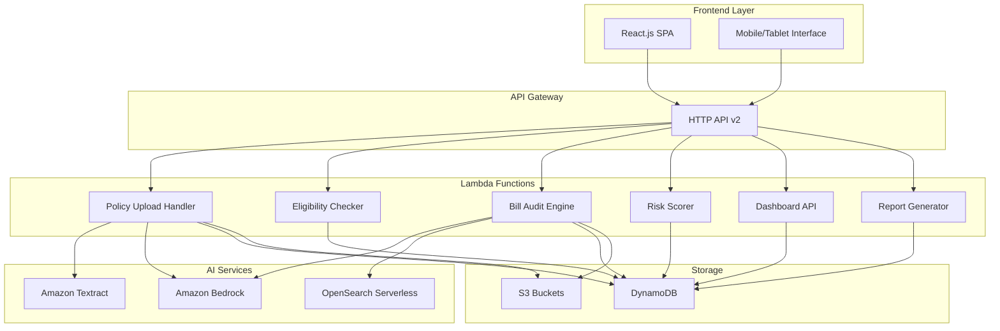

# Design Document: Hospital Insurance Claim Settlement Optimizer

## Overview

The Hospital Insurance Claim Settlement Optimizer is a serverless B2B SaaS system built on AWS that leverages AI services to maximize insurance claim settlement ratios for hospitals. The system processes insurance policy documents, provides real-time treatment eligibility checking, performs pre-submission bill audits, and offers comprehensive analytics through a TPA Command Center dashboard.

The architecture follows a microservices pattern using AWS Lambda functions, with a React.js frontend, DynamoDB single-table design for data persistence, and integration with Amazon Textract, Bedrock, and OpenSearch for AI-powered document processing and analysis.

## Architecture

### High-Level Architecture



### Technology Stack

- **Frontend**: React.js with Vite, Tailwind CSS, React Query for state management, Shadcn/UI components
- **Backend**: AWS Lambda (Python 3.11) with API Gateway HTTP v2
- **Database**: DynamoDB with single-table design using adjacency list pattern
- **Storage**: S3 for document storage with lifecycle policies
- **AI Services**: Amazon Textract for OCR, Amazon Bedrock (Claude 3.5 Sonnet) for analysis, OpenSearch Serverless for semantic search
- **Infrastructure**: AWS CDK for infrastructure as code
- **Authentication**: AWS Cognito with multi-factor authentication

## Components and Interfaces

### 1. Policy Management System

**Policy Upload Handler Lambda**
- Receives policy PDF uploads via presigned S3 URLs
- Triggers Textract for OCR processing
- Invokes Bedrock for policy rule extraction and structuring
- Stores structured policy data in DynamoDB
- Handles error cases and retry logic

**Policy Extractor Service**
- Uses Claude 3.5 Sonnet to parse extracted text
- Identifies coverage rules, exclusions, limits, and procedures
- Structures data into standardized policy schema
- Validates extracted data for completeness

**Interfaces:**
```python
class PolicyUploadRequest:
    hospital_id: str
    policy_name: str
    file_size: int
    content_type: str

class PolicyExtractionResult:
    policy_id: str
    coverage_rules: List[CoverageRule]
    exclusions: List[Exclusion]
    limits: Dict[str, Limit]
    extraction_confidence: float
    processing_status: str
```

### 2. Real-time Eligibility Checker

**Eligibility Checker Lambda**
- Receives treatment/procedure queries with patient context
- Queries DynamoDB for applicable policy rules
- Performs real-time coverage validation
- Returns eligibility status with detailed explanations
- Generates pre-authorization templates when needed

**Coverage Validator Service**
- Matches procedures against policy coverage rules
- Calculates coverage percentages and patient responsibility
- Identifies required pre-authorizations
- Handles complex policy interactions and bundling rules

**Interfaces:**
```python
class EligibilityRequest:
    patient_id: str
    procedure_codes: List[str]
    diagnosis_codes: List[str]
    treatment_date: datetime
    provider_id: str

class EligibilityResponse:
    coverage_status: CoverageStatus
    coverage_percentage: float
    patient_responsibility: Decimal
    policy_references: List[str]
    pre_auth_required: bool
    documentation_template: Optional[str]
```

### 3. Pre-submission Bill Audit System

**Bill Audit Engine Lambda**
- Processes uploaded medical bills and discharge summaries
- Performs line-item analysis against policy rules
- Uses Bedrock for intelligent claim optimization suggestions
- Generates detailed audit reports with approval predictions

**Audit Analyzer Service**
- Validates each bill line item against policy constraints
- Identifies potential rejection reasons
- Suggests modifications to improve approval rates
- Calculates predicted settlement ratios

**Interfaces:**
```python
class BillAuditRequest:
    patient_id: str
    bill_items: List[BillLineItem]
    discharge_summary: str
    claim_amount: Decimal

class AuditResult:
    line_item_results: List[LineItemAudit]
    overall_risk_score: RiskLevel
    predicted_settlement_ratio: float
    optimization_suggestions: List[str]
    policy_violations: List[PolicyViolation]
```

### 4. Risk Assessment System

**Risk Scorer Lambda**
- Analyzes claims using historical data and ML models
- Assigns risk levels based on multiple factors
- Updates risk scores when claim details change
- Provides risk explanations and mitigation strategies

**Risk Assessment Engine**
- Considers policy complexity, claim amount, procedure combinations
- Uses historical rejection patterns for scoring
- Implements ensemble scoring with multiple algorithms
- Provides confidence intervals for risk predictions

### 5. TPA Command Center Dashboard

**Dashboard API Lambda**
- Aggregates data from multiple sources
- Provides real-time claim status and analytics
- Handles filtering, sorting, and search operations
- Generates alerts and notifications

**Analytics Engine**
- Calculates CSR metrics and trends
- Performs comparative analysis against benchmarks
- Generates predictive insights
- Handles real-time dashboard updates

## Data Models

### DynamoDB Single Table Design

**Primary Key Structure:**
- PK (Partition Key): Entity type and identifier
- SK (Sort Key): Related entity or timestamp
- GSI1PK/GSI1SK: Secondary access patterns
- GSI2PK/GSI2SK: Additional query patterns

**Entity Patterns:**

```python
# Hospital Entity
PK: "HOSPITAL#hospital_123"
SK: "METADATA"
hospital_name: str
subscription_tier: str
created_at: datetime

# Policy Entity
PK: "HOSPITAL#hospital_123"
SK: "POLICY#policy_456"
policy_name: str
coverage_rules: dict
extraction_status: str
version: int

# Patient Entity
PK: "HOSPITAL#hospital_123"
SK: "PATIENT#patient_789"
patient_info: dict
active_policies: List[str]
risk_profile: dict

# Claim Entity
PK: "PATIENT#patient_789"
SK: "CLAIM#claim_101"
claim_status: str
line_items: List[dict]
audit_results: dict
risk_score: str

# Audit Trail Entity
PK: "AUDIT#claim_101"
SK: "TIMESTAMP#2024-01-15T10:30:00Z"
action: str
user_id: str
changes: dict
```

**Access Patterns:**
1. Get hospital by ID: PK = "HOSPITAL#hospital_id"
2. Get all policies for hospital: PK = "HOSPITAL#hospital_id", SK begins_with "POLICY#"
3. Get patient claims: PK = "PATIENT#patient_id", SK begins_with "CLAIM#"
4. Get claims by risk level: GSI1PK = "RISK#HIGH", GSI1SK = claim_date
5. Get audit trail: PK = "AUDIT#claim_id", SK range query

### Policy Schema Structure

```python
class CoverageRule:
    procedure_codes: List[str]
    coverage_percentage: float
    annual_limit: Optional[Decimal]
    lifetime_limit: Optional[Decimal]
    pre_auth_required: bool
    exclusions: List[str]

class PolicyDocument:
    policy_id: str
    hospital_id: str
    policy_name: str
    effective_date: datetime
    expiration_date: datetime
    coverage_rules: List[CoverageRule]
    general_exclusions: List[str]
    deductibles: Dict[str, Decimal]
    out_of_pocket_limits: Dict[str, Decimal]
```

## Error Handling

### Error Categories and Responses

**1. Document Processing Errors**
- OCR failures: Retry with different Textract settings, fallback to manual processing
- Policy extraction errors: Return partial results with confidence scores
- File format issues: Clear error messages with supported format guidance

**2. Real-time Query Errors**
- Policy data unavailable: Return uncertainty indicators with manual verification suggestions
- Timeout errors: Implement circuit breakers and graceful degradation
- Invalid procedure codes: Provide code validation and suggestions

**3. System Integration Errors**
- AWS service failures: Implement exponential backoff and retry logic
- Database connection issues: Use connection pooling and health checks
- Authentication failures: Clear error messages with resolution steps

**Error Response Format:**
```python
class ErrorResponse:
    error_code: str
    error_message: str
    error_details: Dict[str, Any]
    retry_after: Optional[int]
    support_reference: str
```

### Monitoring and Alerting

- CloudWatch metrics for Lambda performance and error rates
- Custom metrics for business KPIs (CSR, processing times)
- Automated alerts for system failures and performance degradation
- Distributed tracing with X-Ray for request flow analysis

## Testing Strategy

The testing strategy employs a dual approach combining unit tests for specific scenarios and property-based tests for comprehensive validation of universal system behaviors.

**Unit Testing Focus:**
- Specific examples demonstrating correct functionality
- Edge cases and error conditions (empty files, malformed data, network failures)
- Integration points between AWS services
- Authentication and authorization flows
- API contract validation

**Property-Based Testing Focus:**
- Universal properties that must hold across all valid inputs
- Data consistency and integrity across operations
- Performance characteristics under varying loads
- Security properties across different user roles and data combinations

**Testing Configuration:**
- Property tests configured for minimum 100 iterations using Hypothesis (Python)
- Each property test tagged with format: **Feature: hospital-insurance-claim-settlement-optimizer, Property {number}: {property_text}**
- Unit tests using pytest with comprehensive mocking of AWS services
- Integration tests using LocalStack for AWS service simulation
- End-to-end tests using Playwright for frontend workflows

**Test Environment Setup:**
- Separate test DynamoDB tables with identical schema
- S3 test buckets with lifecycle policies
- Mock implementations for Textract and Bedrock during unit testing
- Test data generators for policies, claims, and patient records

## Correctness Properties

*A property is a characteristic or behavior that should hold true across all valid executions of a system—essentially, a formal statement about what the system should do. Properties serve as the bridge between human-readable specifications and machine-verifiable correctness guarantees.*

After analyzing the acceptance criteria through prework analysis and performing property reflection to eliminate redundancy, the following correctness properties have been identified. Several properties were consolidated where they tested similar behaviors (e.g., multiple "provide proper references" requirements were combined into comprehensive validation properties).

### Policy Management Properties

**Property 1: Policy Processing Round Trip**
*For any* valid policy PDF, processing through OCR extraction and policy structuring should produce retrievable structured data that contains coverage rules, limits, and exclusions
**Validates: Requirements 1.1, 1.2, 1.3**

**Property 2: Policy Error Handling**
*For any* invalid or corrupted policy input, the system should return detailed error messages and maintain system stability
**Validates: Requirements 1.4**

**Property 3: Policy Version Consistency**
*For any* policy that undergoes multiple updates, the version history should maintain a complete chronological chain with immutable audit trails
**Validates: Requirements 1.6**

### Eligibility Checking Properties

**Property 4: Eligibility Response Completeness**
*For any* treatment eligibility query, the response should include coverage status, financial details (when applicable), and policy references with sub-2-second response time
**Validates: Requirements 2.1, 2.2, 2.3, 2.4**

**Property 5: Pre-authorization Template Generation**
*For any* high-risk procedure query, the system should generate appropriate pre-authorization documentation templates
**Validates: Requirements 2.5**

**Property 6: Eligibility Uncertainty Handling**
*For any* eligibility query with incomplete policy data, the system should clearly indicate uncertainty and provide manual verification guidance
**Validates: Requirements 2.6**

### Bill Audit Properties

**Property 7: Comprehensive Line Item Analysis**
*For any* uploaded medical bill, every line item should be analyzed against applicable policy rules and categorized as approved, rejected, or requires review within 30 seconds for bills up to 100 items
**Validates: Requirements 3.1, 3.2, 3.7**

**Property 8: Rejection Explanation Completeness**
*For any* rejected line item, the system should provide specific policy clause references and detailed rejection reasons
**Validates: Requirements 3.3**

**Property 9: Settlement Ratio Prediction**
*For any* completed bill audit, the system should calculate and return a predicted claim settlement ratio
**Validates: Requirements 3.4**

**Property 10: Optimization Suggestions**
*For any* bill with potential improvements, the system should highlight modifiable line items with specific improvement suggestions
**Validates: Requirements 3.5**

**Property 11: Procedure Bundling Validation**
*For any* bill containing multiple procedures, the system should validate procedure combinations against applicable policy bundling rules
**Validates: Requirements 3.6**

### Risk Assessment Properties

**Property 12: Risk Score Assignment**
*For any* processed claim, the risk scorer should assign exactly one risk level (High, Medium, or Low) with explanatory reasoning based on historical patterns, policy complexity, and claim amount
**Validates: Requirements 4.1, 4.2, 4.3**

**Property 13: Risk Score Updates**
*For any* claim modification, the risk score should be recalculated and updated to reflect the changes
**Validates: Requirements 4.4**

**Property 14: Multi-claim Risk Aggregation**
*For any* patient with multiple claims, the system should calculate and maintain aggregated risk assessment across all related claims
**Validates: Requirements 4.5**

### Dashboard Properties

**Property 15: Dashboard Data Completeness**
*For any* dashboard access, all active patients should be displayed with complete claim status, risk levels, pending actions, and settlement predictions, loading within 3 seconds
**Validates: Requirements 5.1, 5.2, 5.6**

**Property 16: Dashboard Filtering and Analytics**
*For any* dashboard filtering or sorting operation by risk level, claim amount, or submission date, the results should be accurate and include real-time analytics (CSR, processing times, rejection reasons)
**Validates: Requirements 5.3, 5.5**

**Property 17: Alert Display**
*For any* generated alert, the dashboard should prominently display it with clear, actionable information
**Validates: Requirements 5.4**

### Security Properties

**Property 18: Data Encryption Standards**
*For any* data transmission or storage operation, the system should use TLS 1.3+ for transit and AES-256 for rest encryption
**Validates: Requirements 6.1, 6.2**

**Property 19: Authentication and Access Control**
*For any* system access attempt, multi-factor authentication should be required and role-based access controls should restrict users to appropriate resources only
**Validates: Requirements 6.3, 6.6**

**Property 20: Audit Logging**
*For any* data access or modification operation, detailed audit logs should be created and maintained
**Validates: Requirements 6.4**

### API Properties

**Property 21: API Response Consistency**
*For any* API request, the system should return structured JSON responses with consistent error handling and appropriate HTTP status codes
**Validates: Requirements 7.1, 7.3, 7.6**

**Property 22: API Performance**
*For any* eligibility API call, the response time should be under 2 seconds, and the system should support up to 1000 concurrent eligibility checks per minute
**Validates: Requirements 7.2, 8.1**

**Property 23: Webhook Notifications**
*For any* completed audit process, appropriate webhook notifications should be sent to registered endpoints
**Validates: Requirements 7.4**

### Performance Properties

**Property 24: Document Processing Performance**
*For any* policy document up to 50MB, OCR extraction and processing should complete within 5 minutes
**Validates: Requirements 8.2**

**Property 25: Auto-scaling Performance**
*For any* increase in system load, resources should automatically scale to maintain performance standards without degradation
**Validates: Requirements 8.4**

**Property 26: Multi-tenant Performance**
*For any* concurrent operations across up to 100 hospitals, the system should maintain performance without interference between tenants
**Validates: Requirements 8.5**

**Property 27: Database Performance**
*For any* standard database query operation, results should be returned within 500ms
**Validates: Requirements 8.6**

### Reporting Properties

**Property 28: Report Generation Completeness**
*For any* generated report, it should include CSR trends, rejection analysis, policy clause frequency, and benchmark comparisons in both PDF and Excel formats
**Validates: Requirements 9.1, 9.2, 9.3, 9.4**

**Property 29: Metrics Tracking**
*For any* system operation, processing time improvements and cost savings should be tracked and reportable
**Validates: Requirements 9.5**

**Property 30: Report Navigation**
*For any* summary metric in reports, drill-down capabilities should provide access to individual claim details
**Validates: Requirements 9.6**

### Audit Trail Properties

**Property 31: Audit Immutability**
*For any* created audit log entry, it should remain immutable and maintain complete chronological records
**Validates: Requirements 10.1, 10.4**

**Property 32: Document Metadata Preservation**
*For any* processed document, original files should be stored with complete timestamps and user attribution
**Validates: Requirements 10.2**

**Property 33: Change Tracking**
*For any* claim modification, before and after states should be recorded with complete comparison data
**Validates: Requirements 10.3**

**Property 34: Audit Search Capabilities**
*For any* audit record search or filtering operation, the system should provide accurate and complete results across all stored audit data
**Validates: Requirements 10.6**